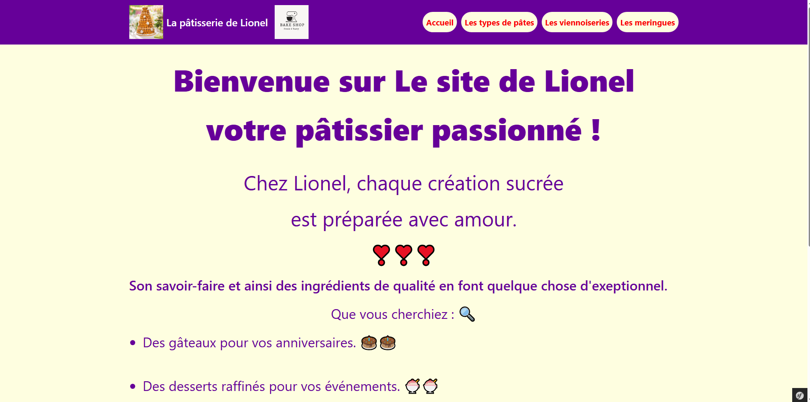
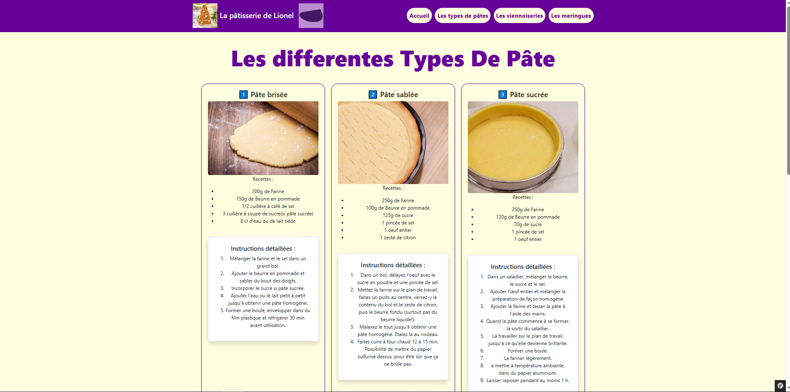
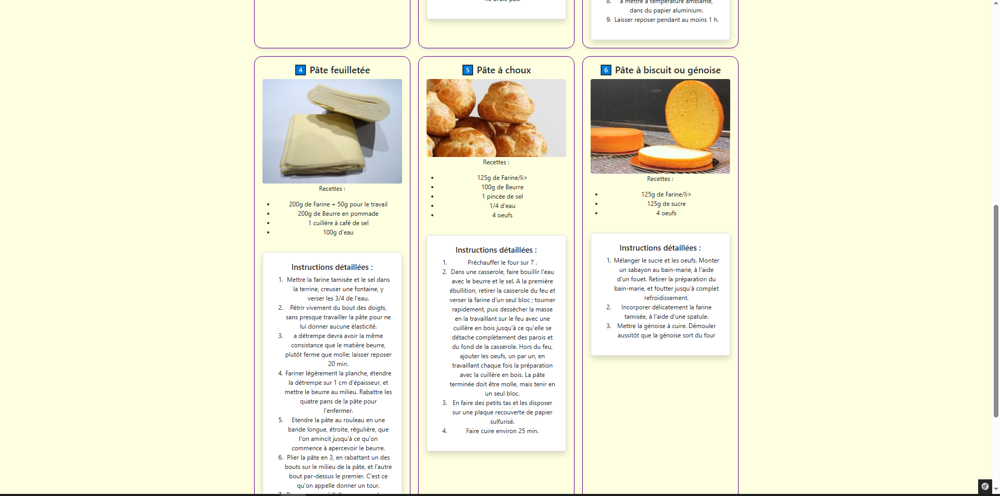
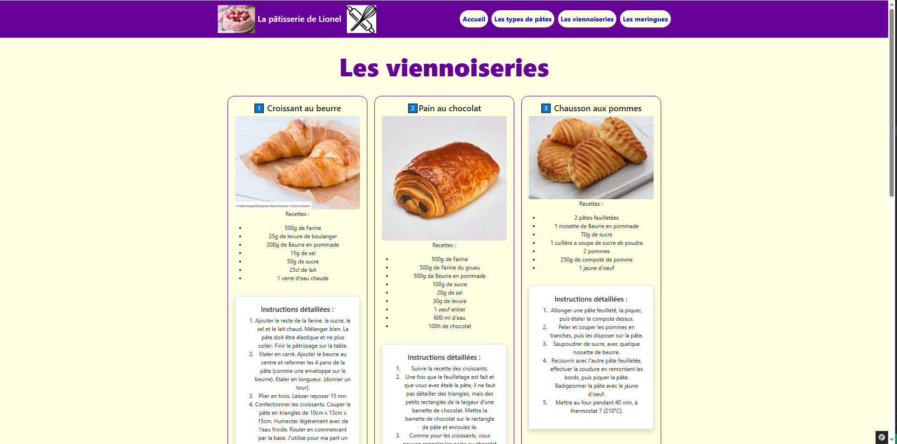
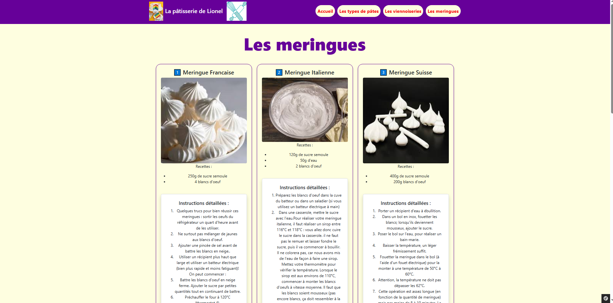

# La Pâtisserie de Lionel - Portfolio Symfony

### 🏠 Page d’accueil  
  

### Les différentes types de pâtes
 
  

### Les viennoiseries 
  

### Les meringues
  

## Description
- Symfony version 7.3.3
- PHP 8.2.12 (cli)
- Frontend responsive, HTML, CSS, JS
- Pages : Packages PHP : Twig, Doctrine, etc.
  
